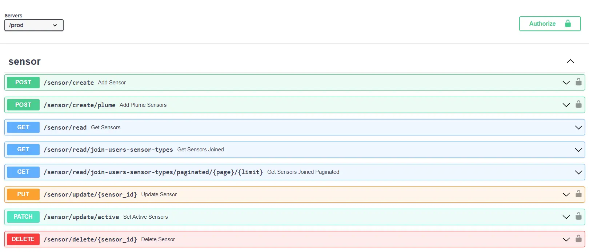

<a name="readme-top"></a>

<!-- PROJECT SHIELDS -->
[![Deployment][passing-deployment-badge]][api-url]
![Tests][passing-tests-badge]
<!-- 


 -->

<!--  -->

<!-- PROJECT LOGO -->
<br />
<div align="center">
  <a href="https://github.com/AstonAirQuality/AirQuality-API">
    
  </a>

<h3 align="center">AstonAirQuality API</h3>

  
  

  <p align="center">
    A Fast API project to manage Aston University's fleet of air quality sensors and handle batch data ingestion tasks.
    <br />
    <a href="https://github.com/AstonAirQuality/AirQuality-API"><strong>Explore the docs »</strong></a>
    <br />
    <br />
    <a href="https://github.com/AstonAirQuality/AirQuality-API">View Demo</a>
    ·
    <a href="https://github.com/AstonAirQuality/AirQuality-API/issues">Report Bug</a>
    ·
    <a href="https://github.com/AstonAirQuality/AirQuality-API/issues">Request Feature</a>
  </p>
</div>

<!-- TABLE OF CONTENTS -->
<details>
  <summary>Table of Contents</summary>
  <ol>
    <li>
      <a href="#about-the-project">About The Project</a>
      <ul>
        <li><a href="#built-with">Built With</a></li>
      </ul>
    </li>
    <li>
      <a href="#getting-started">Getting Started</a>
      <ul>
        <li><a href="#prerequisites">Prerequisites</a></li>
        <li><a href="#installation">Installation</a></li>
            <ul>
                <li><a href="#docker-setup">Docker Setup</a></li>
                <li><a href="#local-setup">Local Setup</a></li>
            </ul>
        <li><a href="#running-tests">Running Tests</a></li>
            <ul>
                <li><a href="#docker-setup-1">Docker Setup</a></li>
                <li><a href="#local-setup-1">Local Setup</a></li>
            </ul>
      </ul>
    </li>
    <li><a href="#additionalInformation">Addtional Information</a></li>
    <li><a href="#contact">Contact</a></li>
  </ol>
</details>

<!-- ABOUT THE PROJECT -->
## About The Project

<a href="https://github.com/AstonAirQuality/AirQuality-API">
    
</a>

<p>
This project is a Fast API application that provides a RESTful API to manage Aston University's fleet of air quality sensors and handle batch data ingestion tasks. The API is hosted on AWS Lambda and is connected to a PostGreSQL database hosted on AWS RDS. The API is secured using JWT authentication and is documented using Swagger UI. The API is also connected to a cron job that runs every 24 hours to ingest data from the Plume Labs API, the Zephyr API and the SensorCommunity API. 
</p>

<p align="right">(<a href="#readme-top">back to top</a>)</p>

### Built With
* [![Fast-API][fast-api-badge]][fast-api-url]
* [![AWS-Lambda][aws-lambda-badge]][aws-lambda-url]
* [![PostGreSQL][postgresql-badge]][postgres-url]
* [![Docker][docker-badge]][docker-url]

<!-- GETTING STARTED -->
## Getting Started

To get a local copy up and running follow these simple steps.

### Prerequisites

#### Complete setup project with Firebase Services
1) Setup a firebase project 
2) Enable Authentication and Realtime database services 
3) Copy the admin sdk into the app/config directory in the project files.

#### Local setup without Firebase Services
1) Firevase services are not required, however you will still need to complete the environment variables setup in the next step.


#### Docker Setup
* Docker Desktop - install from [here](https://www.docker.com/products/docker-desktop)

#### Local Setup
* Python 3.9.6+ - install from [here](https://www.python.org/downloads/)


### Installation

The following steps are requried for both local and docker setups.

1. Clone the repo
   ```sh
   git clone AstonAirQuality/AirQuality-API
    ```
2. Enter your enviornment variables in `.env-template`
   ```env
    PLUME_EMAIL= YOUR_PLUME_EMAIL
    PLUME_PASSWORD= YOUR_PLUME_PASSWORD
    JWT_SECRET= YOUR_JWT_SECRET
    ZEPHYR_USERNAME = YOUR_ZEPHYR_USERNAME
    ZEPHYR_PASSWORD = YOUR_ZEPHYR_PASSWORD
    SC_USERNAME = YOUR_SC_USERNAME
    SC_PASSWORD = YOUR_SC_PASSWORD
    CRON_JOB_TOKEN= YOUR_CRON_JOB_TOKEN
   ```
   If you are using Firebase services, you will also need to add the following variables:
   ```env
    FIREBASE_API_KEY= YOUR_FIREBASE_API_KEY
    FIREBASE_AUTH_DOMAIN= YOUR_FIREBASE_AUTH_DOMAIN
    FIREBASE_PROJECT_ID= YOUR_FIREBASE_PROJECT_ID
    FIREBASE_STORAGE_BUCKET= YOUR_FIREBASE_STORAGE_BUCKET
    FIREBASE_MESSAGING_SENDER_ID= YOUR_FIREBASE_MESSAGING_SENDER_ID
    FIREBASE_APP_ID= YOUR_FIREABASE_APP_ID
    FIREBASE_MEASUREMENT_ID= YOUR_FIREBASE_MEASUREMENT_ID
    # remember to store the JSON inside app/config
    FIREBASE_SERVICE_ACCOUNT= YOUR_PATH_TO_SERVICE_ACCOUNT_JSON 
    FIREBASE_DATABASE_URL= YOUR_FIREBASE_DB_URL
   ```

3. Copy `.env-template` to `.env` and enter your enviornment variables
   ```sh
   cp .env-template .env
   ```

4. Now follow the setup instructions for your chosen setup method.

#### Docker Setup
5. From the project root directory, run the command 
    ```sh
    docker-compose up
    ```
6.  After the containers have been built visit http://localhost:8000/docs to view the API documentation


#### Local Setup
5. From the project root directory, run the command below to install the project dependencies
   ```sh
   pip install -r requirements.txt
    ```
6. From the project root directory, run the command below to start the API
    ```sh
    uvicorn app.main:app --reload
    ```
7. After the API has started visit http://localhost:8000/docs to view the API documentation


### Running Tests

#### Docker Setup
1. From the project root directory, run the command below to start the test container
    ```sh
    docker-compose -f docker-compose-testenv.yml -p test up -d
    ```
2. Choose one of the following methods to run the tests
    1. Using VSCode, open the project root directory and run the tests using the test explorer
    2. From the project root directory, run the command below to run the tests using Docker
        ```sh
        docker exec -it test_app_ python -m unittest discover -s testing -p test_*.py
        ```
    3. From the project root directory, run the command below to run the tests with coverage in a local terminal (Python installation required)
        ```sh
        python -m coverage run -m unittest discover -s testing -p test_*.py
        ```
        Then run the command below to view the coverage report
        ```sh
        python -m coverage report --omit="*/testing*
        ```
        Or run the command below to export the coverage report in html
        ```sh
        python -m coverage html --omit="*/testing*"
        ```
3. To delete the container, run the command 
    ```sh
    docker-compose -f docker-compose-testenv.yml -p test down --volumes
    ```
    
<p align="right">(<a href="#readme-top">back to top</a>)</p>

<!-- Additional Info -->
## Additional Information
- [Database Migrations](.github/resources/further-instructions/DatabaseMigrations.md)
- [Deployment](.github/resources/further-instructions/Deployment.md)
- [RDS to EC2 Migration Instructions](.github/resources/further-instructions/RDS_TO_EC2.md)

<!-- CONTACT -->
## Contact

Twitter (X): [@dev_riyad](https://twitter.com/dev_riyad) 
<br/>
Email: riyad23008@gmail.com
<br/>
Project Link: [https://github.com/AstonAirQuality/AirQuality-API](https://github.com/AstonAirQuality/AirQuality-API)

<p align="right">(<a href="#readme-top">back to top</a>)</p>


<!-- MARKDOWN LINKS & IMAGES -->
[api-url]: https://rn3rb93aq5.execute-api.eu-west-2.amazonaws.com/prod/docs
[passing-deployment-badge]: https://img.shields.io/badge/deployment-success-green
[passing-tests-badge]: https://img.shields.io/badge/tests-success-green
[fast-api-badge]: https://img.shields.io/badge/FastAPI-grey?logo=fastapi
[fast-api-url]: https://fastapi.tiangolo.com/
[aws-lambda-badge]: https://img.shields.io/badge/Lambda-b45309?logo=awslambda
[aws-lambda-url]: https://aws.amazon.com/lambda/
[postgresql-badge]: https://img.shields.io/badge/PostGreSQL-93c5fd?logo=postgresql
[postgres-url]: https://www.postgresql.org/
[docker-badge]: https://img.shields.io/badge/Docker-7dd3fc?logo=docker
[docker-url]: https://www.docker.com/
